<div align="center">

# 🌦️ Smart Precipitation Classification & Forecasting System

<p align="center">
  
  
  
  
  
</p>

<p align="center">
  
  
  
</p>

---

## 🎯 Project Vision

Transform weather data into **actionable intelligence** through advanced machine learning algorithms. This comprehensive system bridges the gap between raw meteorological data and real-world decision-making by providing accurate precipitation classification and humidity forecasting with intelligent risk assessment.

> **🚀 Mission**: Democratize weather intelligence for smart cities, agriculture, and climate-resilient infrastructure

</div>

---

## 📋 Table of Contents

- [🌟 Key Features](#-key-features)
- [🔧 Technology Stack](#-technology-stack)
- [📊 System Architecture](#-system-architecture)
- [🎪 Live Demo](#-live-demo)
- [⚡ Quick Start Guide](#-quick-start-guide)
- [📈 Model Performance](#-model-performance)
- [🔮 Forecasting Engine](#-forecasting-engine)
- [🚨 Alert System](#-alert-system)
- [📱 User Interface](#-user-interface)
- [🧪 Technical Implementation](#-technical-implementation)
- [🌍 Real-World Applications](#-real-world-applications)
- [👨‍💻 Author](#-author)

---

## 🌟 Key Features

<table>
<tr>
<td width="50%">

### 🧠 **Intelligent Classification**
- **98.92% Accuracy** with Decision Tree algorithm
- Multi-class precipitation detection
- Real-time confidence scoring
- Robust outlier handling

### 📈 **Advanced Forecasting**
- ARIMA-based humidity prediction
- 3-day forecast horizon
- Trend analysis & visualization

</td>
<td width="50%">

### 🚨 **Smart Alert System**
- Risk-based notification engine
- Probability threshold management
- Multi-level alert categories
- Customizable warning triggers

### ⚡ **Real-Time Simulation**
- Streaming data processing
- Interactive visualizations
- Performance monitoring

</td>
</tr>
</table>

---

## 🔧 Technology Stack

<div align="center">

### Core Technologies

| Category | Technologies |
|----------|-------------|
| **🧠 Machine Learning** |    |
| **📊 Visualization** |    |
| **🌠Web Framework** |  |
| **📈 Time Series** |  |
| **☁️ Deployment** |   |

</div>

---

## 📊 System Architecture

```mermaid
graph TB
    A[🌦️ Weather Data Input] --> B[🔧 Data Preprocessing]
    B --> C[📊 Exploratory Data Analysis]
    C --> D[⚙️ Feature Engineering]
    D --> E[🧠 Model Training Pipeline]
    
    E --> F[🎯 SVM Classifier]
    E --> G[🌲 Decision Tree]
    E --> H[👥 K-Nearest Neighbors]
    E --> I[📊 Naive Bayes]
    
    F --> J[🏆 Model Selection & Evaluation]
    G --> J
    H --> J
    I --> J
    
    J --> K[🔮 ARIMA Forecasting]
    J --> L[🚨 Alert Generation]
    K --> M[📱 Streamlit Dashboard]
    L --> M
    
    M --> N[👤 End User Interface]
    
    style A fill:#e1f5fe
    style N fill:#f3e5f5
    style J fill:#fff3e0
```



---

🎪 Live Demo
<div align="center">
🌐 Experience the System Live
<div align="center">
  <a href="https://e2jsej5mcfzgxdxnzazovz.streamlit.app/" target="_blank">
    
  </a>
</div>
🌐 Live Demo URL: https://m9tqu6hvyyjrub5mesbqrl.streamlit.app/

</div>

---

## ⚡ Quick Start Guide

<details>
<summary><b>🚀 Click to expand installation steps</b></summary>

### 1️⃣ Prerequisites
```bash
# Ensure Python is installed
python --version
```

### 2️⃣ Clone Repository
```bash
git clone https://github.com/Vishnunandan24/Smart-Precipitation-Classification-and-Forecasting-System-with-Risk-Alerts.git
cd Smart-Precipitation-Classification-and-Forecasting-System-with-Risk-Alerts.git
```

### 4️⃣ Install Dependencies
```bash
pip install -r requirements.txt
```

### 5️⃣ Launch Application
```bash
streamlit run app.py
```

### 6️⃣ Access Dashboard
Open your browser and navigate to: `http://localhost:8501`

</details>

---

## 📈 Model Performance

<div align="center">

### 🏆 Algorithm Comparison

| 🥇 Rank | Algorithm | Accuracy |
|---------|-----------|----------|
| **🥇** | **Decision Tree** | **98.92%** |
| 🥈 | Support Vector Machine | 98.83% |
| 🥉 | K-Nearest Neighbors | 97.94% |
| 4️⃣ | Naive Bayes | 92.94% |


### 🎯 Classification Report of Decision Tree Algorithm
```
                precision    recall  f1-score   support

    No Precipitation   0.06      0.07      0.07       104
              Rain     0.99      0.99      0.99       16470
              Snow     1.00      1.00      1.00       2017
    
         accuracy                          0.99      18591
        macro avg      0.69      0.69      0.69      18591
     weighted avg      0.99      0.99      0.99      18591
```

</div>

---

## 🔮 Forecasting Engine

<div align="center">

### 📈 ARIMA Time Series Modeling

</div>

Our forecasting system utilizes **ARIMA (AutoRegressive Integrated Moving Average)** to predict humidity :

#### 🔬 **Technical Specifications**
- **Model Type**: ARIMA(p,d,q) with automated parameter selection
- **Forecast Horizon**: 3-day rolling predictions
- **Confidence Intervals**: 95% statistical confidence bounds
- **Update Frequency**: Real-time with each new data point (used 1st 5 samples) 

## 🚨 Alert System

<div align="center">

### ⚡ Intelligent Risk Assessment Engine

</div>

Our AI-powered alert system provides **contextual warnings** based on prediction confidence and weather severity:

#### 🎚️ **Alert Categories**

<table>
<tr>
<td width="25%" align="center">

### 🚨 **CRITICAL**
**Rain + 90%+ Confidence**
- Rainfall alert - stay safe


</td>
<td width="25%" align="center">

### ⚠️ **HIGH**
**Snow or Rain + 80%+ Confidence**
- Snowfall Expected


</td>
<td width="25%" align="center">

### ✅ **LOW**
**No Precipitation + 80%+ Confidence**
- Safe conditions
- Normal operations
- Clear weather expected

</td>
</tr>
</table>

#### 🧠 **Smart Alert Logic**
```python
def generate_intelligent_alert(prediction, probability, humidity_trend):
    """
    Multi-factor alert generation considering:
    - Precipitation type and probability
    - Humidity trend analysis
    - Historical risk patterns
    - Seasonal adjustments
    """
    if prediction == "Rain" and probability > 0.90:
        if humidity_trend > 80:
        return "🚨 HIGH RISK: Rainfall Alert - Stay Safe"
    
    elif prediction == "Snow" and probability > 0.85:
        return "❄️ WINTER ALERT: Snowfall Expected - Travel Caution"
    
    elif prediction == "No Precipitation" and probability > 0.80:
        return "✅ CLEAR SKIES: Safe Weather Conditions"
    
    else:
        return "🔍 UNCERTAIN: Monitor Weather Closely"
```

---

## 📱 User Interface

<div align="center">

### 🎨 Interactive Streamlit Dashboard

</div>

Our user-friendly interface provides comprehensive weather intelligence through multiple interactive sections:

#### 🏠 **Dashboard Sections**

<table>
<tr>
<td width="33%" align="center">

### 📊 **Analytics Hub**
- Correlation heatmaps
- Distribution analysis
- Outlier detection
- Feature importance

</td>
<td width="33%" align="center">

### 🔮 **Prediction Center**
- Real-time classification
- Confidence scoring
- Model comparison
- Performance metrics

</td>
<td width="33%" align="center">

### 📈 **Forecast Studio**
- ARIMA predictions
- Trend visualization
- Confidence intervals

</td>
</tr>
</table>

#### 🎛️ **Interactive Controls**
- **Model Selection**: Choose between SVM, Decision Tree, KNN, or Naive Bayes
- **Alert Sensitivity**: Customize warning thresholds
- **Visualization Options**: Toggle between different chart types

---

## 🧪 Technical Implementation

<details>
<summary><b>🔬 Advanced Technical Details</b></summary>

### ⚙️ **Feature Engineering Pipeline**

```python
def create_weather_features(df):
    """
    Advanced feature engineering for weather prediction
    """
    # Rolling statistics
    df['humidity_ma_7'] = df['humidity'].rolling(window=7).mean()
    df['humidity_std_7'] = df['humidity'].rolling(window=7).std()
    
    # Lag features
    df['humidity_lag_1'] = df['humidity'].shift(1)
    df['humidity_lag_3'] = df['humidity'].shift(3)
    
    # Interaction features
    df['temp_humidity_interaction'] = df['temperature'] * df['humidity']
    df['pressure_humidity_ratio'] = df['pressure'] / df['humidity']
    
    # Seasonal decomposition
    decomposition = seasonal_decompose(df['humidity'], model='additive')
    df['humidity_trend'] = decomposition.trend
    df['humidity_seasonal'] = decomposition.seasonal
    
    return df
```
</details>

---

## 🌍 Real-World Applications

<div align="center">

### 🎯 Industry Impact & Use Cases

</div>

<table>
<tr>
<td width="50%">

#### 🌾 **Smart Agriculture**
- **Irrigation Optimization**: Predict humidity to schedule efficient watering
- **Crop Protection**: Early frost and precipitation warnings
- **Yield Forecasting**: Weather-based crop yield predictions
- **Pest Management**: Weather-driven pest outbreak alerts

#### 🏙️ **Smart Cities**
- **Traffic Management**: Weather-based traffic flow optimization
- **Emergency Response**: Proactive disaster preparedness
- **Energy Grid**: Weather-informed energy demand forecasting
- **Public Safety**: Citizens weather alert system

</td>
<td width="50%">

#### 🚛 **Logistics & Transportation**
- **Route Planning**: Weather-aware delivery optimization
- **Fleet Management**: Vehicle maintenance scheduling
- **Supply Chain**: Weather impact on logistics networks
- **Aviation**: Flight planning and delay predictions

#### ⚡ **Energy Sector**
- **Renewable Energy**: Solar/wind power generation forecasting
- **Grid Stability**: Weather-based load balancing
- **Maintenance**: Weather-dependent infrastructure maintenance
- **Demand Response**: Weather-driven energy consumption patterns

</td>
</tr>
</table>


## 👨‍💻 Author

<div align="center">

### **Vishnu Nandan**
*Aspiring Data Scientist | AI & ML Enthusiast*

<p align="center">
  <a href="https://www.linkedin.com/in/jonnalagaddavishnu/"></a>
  <a href="https://github.com/Vishnunandan24"></a>
  <a href="mailto:vishnunandan24@gmail.com"></a>
</p>

*"Transforming data into insights, one model at a time"*

</div>

## ⭐ Support This Project

<div align="center">

### 🌟 Show Your Support!

If you found this project helpful or interesting, please consider:

<p align="center">
  <a href="https://github.com/Vishnunandan24/weather-precipitation-classification/stargazers">
    
  </a>
  <a href="https://github.com/Vishnunandan24/weather-precipitation-classification/network/members">
    
  </a>
  <a href="https://github.com/Vishnunandan24/weather-precipitation-classification/watchers">
    
  </a>
</p>

### 💝 Ways to Support
- ⭐ **Star** this repository
- 🍴 **Fork** and contribute
- 🐛 **Report** bugs and issues
- 📢 **Share** with the community
- 💡 **Suggest** new features

</div>

---

<div align="center">

### 💭 *"In a world full of data, smart decisions come from smart models."*


**Happy Weather Forecasting! 🌤️**

---

*Made with ❤️ by [Vishnu Nandan](https://github.com/Vishnunandan24) | © 2024 Weather Intelligence System*

</div>
